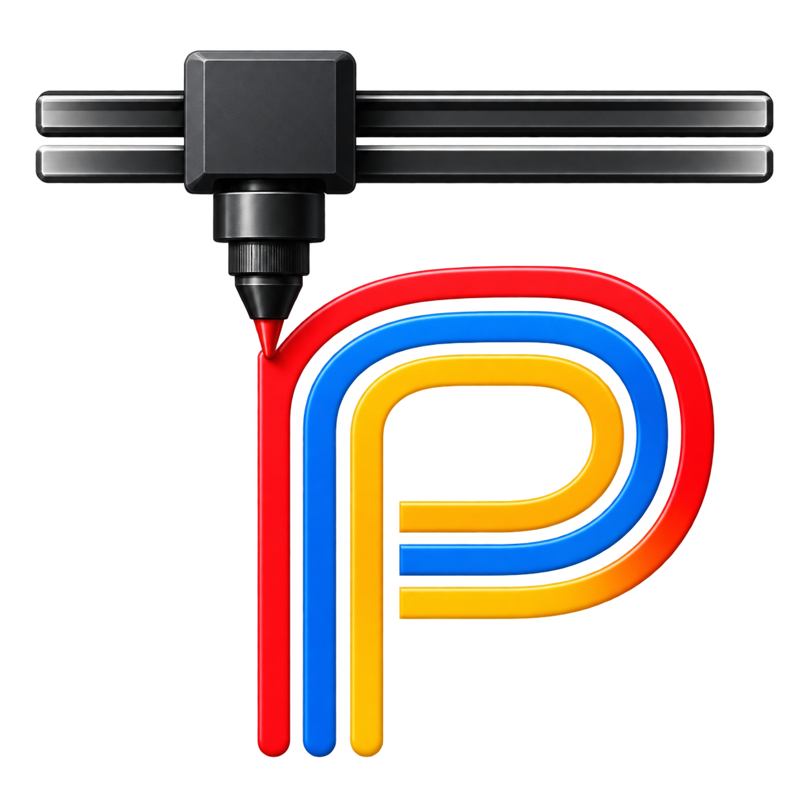

<p align="center">
  
</p>

<h1 align="center">PlotPilot</h1>

<p align="center">
  Open-source macOS app for plotting SVG drawings on an
  <a href="https://axidraw.com/">AxiDraw</a>.
</p>

<p align="center">
  <a href="LICENSE"></a>
  
  
  
  
</p>

<p align="center">
  
</p>

<p align="center">
  <em>Place the drawing, watch the page, and plot layer by layer — with progress, pen changes, and a safe stop.</em>
</p>

PlotPilot is a desktop controller for pen plotters. It opens an SVG, lists its layers, shows each layer on the machine’s page, and sends that same geometry to the AxiDraw through [`axicli`](https://axidraw.com/doc/cli_api/). The preview is the prepared plot: position, scale, rotation, margins, and clipping are applied before anything is drawn on screen or on paper.

A downloadable Mac app is a zip of `PlotPilot.app`, built on your machine with `./package-release.sh`. It is not signed with an Apple Developer ID, so the first open is a right-click. The zip includes `axicli`, so the person who receives it does not install Python or the AxiDraw command-line tools.

## What you can do

<table>
<tr>
<td width="50%" valign="top">

### Layers that match the file

Inkscape layers, with root groups used when a file has no layer markup. Each row shows a colour, a name, and a path count. Select a layer to preview it. Check the layers that belong in a multi-pen job.

</td>
<td width="50%" valign="top">

### A page you can trust

Millimetre rulers, the physical work area, and a dashed printable outline. Drag the drawing to place it, or set X, Y, and scale in the Transform tab. Zoom and pan are view-only and do not move the plot.

</td>
</tr>
<tr>
<td width="50%" valign="top">

### Margins and orientation

Horizontal and vertical safe margins (0.1 mm) inset the printable area. Strokes that cross a margin are clipped. Keep the page as drawn, auto-rotate it to fit, or turn it 90° either way. The preview updates with the choice.

</td>
<td width="50%" valign="top">

### Plot settings that stick

Pen-down speed, pen-up speed, acceleration, servo heights, constant pen-down speed, machine model, and path order. Values are remembered between launches. A `.plotpilot` project file stores the setup for one drawing.

</td>
</tr>
<tr>
<td width="50%" valign="top">

### One layer, or a pen-change sequence

**Plot Selected Layer** sends the current layer. **Plot Checked Layers** walks the checked layers and pauses so you can change pens, then **Continue**. **Estimate** reports duration before the motors move.

</td>
<td width="50%" valign="top">

### A machine you can stop

Live progress (percent, elapsed, remaining), pen up and pen down, home, and motors off. **Stop** cancels the plot, raises the pen, walks home, and disables the XY motors.

</td>
</tr>
</table>

Supported models: AxiDraw V2 / V3 / SE/A4, V3/A3 or SE/A3, V3 XLX, MiniKit, SE/A1, SE/A2, and V3/B6. The travel limits of the selected model define the page.

## A plotting session

1. Connect the plotter. A release zip already includes `axicli`. From a source checkout, install [AxiDraw software](https://axidraw.com/doc/) so `axicli` is on your `PATH`.
2. Launch PlotPilot and open an SVG (**File → Open SVG…**, **⌘O**).
3. Pick a layer. Fit the preview, then place, scale, and rotate the drawing inside the printable area.
4. Set margins and speeds. Run **Estimate** if you want a duration before plotting.
5. **Plot Selected Layer**, or check several layers and **Plot Checked Layers**. Swap pens when the app pauses, then press **Continue**.
6. Save a **project** (**⌘S**) to reopen the same SVG, checks, placement, margins, and plot settings.

The full walkthrough, shortcuts, and control reference are in the [user guide](docs/guide.md).

## Requirements

- macOS
- [Python 3.12](https://www.python.org/)
- [uv](https://docs.astral.sh/uv/)
- [AxiDraw software](https://axidraw.com/doc/) (`axicli` on `PATH`) when you run from source and want to plot

The interface and plot preparation run without hardware. A connected AxiDraw is needed only when you plot. A zip from `./package-release.sh` already contains `axicli`.

## Run PlotPilot

```bash
git clone https://github.com/bolet777/plotpilot.git
cd plotpilot
uv sync --group dev
./lance.sh
```

`./lance.sh` builds `dist/PlotPilot.app` and opens it, with the PlotPilot name and icon in the Dock. Later launches can skip the build:

```bash
./lance.sh --no-build
```

For a faster edit loop, run from source. The Dock may show Python instead of PlotPilot:

```bash
uv run plotpilot
```

## Share a build

On your Mac, from the repository root:

```bash
./package-release.sh
```

This builds `PlotPilot.app`, downloads the official AxiDraw command-line interface into the app, writes `dist/PlotPilot-<version>-macos-<arch>.zip`, and uploads that zip to a [GitHub Release](https://github.com/bolet777/plotpilot/releases) tagged `v<version>`. The zip stays out of git. Commit the source first: the script pushes that commit, then attaches the zip. `./package-release.sh --no-publish` stops after the zip.

Build on the same kind of Mac your recipients use. An Apple Silicon zip does not launch on an Intel Mac.

The app stays MIT. `axicli` stays a separate program, with its own license files inside the bundle. It is not added to PlotPilot’s Python dependencies.

## Documentation

| | |
|---|---|
| [User guide](docs/guide.md) | Interface, plotting, projects, shortcuts |
| [Documentation index](docs/README.md) | All docs in this repository |
| [Architecture](docs/ARCHITECTURE.md) | Modules and data flow |
| [Feature specs](specs/README.md) | SpecKit slices behind each capability |

## Development

```bash
uv run pytest
uv run ruff check src tests
uv run ruff format src tests
```

Tests use a fake plotter and do not need a display, an AxiDraw, or `axicli`. See [tests/README.md](tests/README.md) and [docs/testing.md](docs/testing.md).

Icons are regenerated from `assets/icons/icon.png` with `./scripts/regenerate_icons.sh`. A bundle-only build is `./scripts/build_macos_app.sh`.

## License

**MIT** — see [LICENSE](LICENSE).
