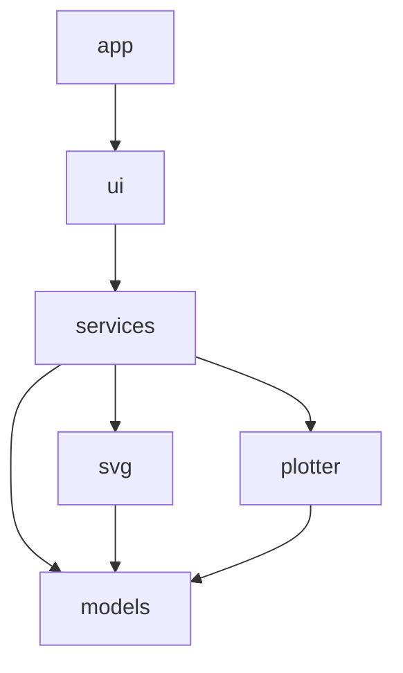

# PlotPilot architecture

High-level layout of the application as implemented. User capabilities map to
SpecKit slices **001–010** under `specs/`; this document describes how code is
organized today.

## Goals

- macOS desktop app for pen plotters (AxiDraw first)
- Open SVG, inspect layers, preview one layer, plot one or many layers
- Pen changes between layers in multi-layer mode
- Test core logic without hardware

## Module map

```text
src/plotpilot/
  app/           `run()`, macOS Dock/menu branding (`macos.py`)
  resources/     App icons (PNG sizes + `plotpilot.icns`)
  ui/            MainWindow, LayerPreviewWidget, PlotSettingsWidget
  svg/           parse.py, layers.py, preview.py
  plotter/       PlotterBackend protocol, axidraw.py (axicli), fake.py
  services/      svg_loader, layer_service, preview_service, plot_service,
                 plotter_service, multi_layer_plot_service, settings_service
  models/        SvgDocument, SvgLayer, plot jobs, PlotterStatus, PlotSettings, …
packaging/macos/ PyInstaller `entry.py` + `plotpilot.spec` → dist/PlotPilot.app
```

## Dependency direction



- **ui** calls **services** only (not `plotter` or low-level SVG parsers directly).
- **services** coordinate **models**, **svg**, and **plotter**.
- **plotter** exposes detect, pen, plot, walk_home, disable_xy via `PlotterBackend`.
- **svg** has no Qt imports.

## Main flows

### Open SVG

`MainWindow` → `load_svg_from_path` → `parse_svg_text` → `SvgDocument` →
`layers_for_document` / `extract_layers` → layer list + preview refresh.

### Preview

Layer selection → `preview_svg_for_layer` → `LayerPreviewWidget` renders SVG text.

### Single-layer plot

UI → `PlotterService.start_plot_layer` → build layer SVG (`plot_svg_for_layer`) →
temp file → `AxiDrawCliBackend.plot_svg` (subprocess `axicli`) with snapshotted
`PlotSettings`.

### Multi-layer plot

UI → `MultiLayerPlotService.start_job` → sequential layer plots →
`WAITING_FOR_PEN_CHANGE` → user **Continue** → next layer.

### Stop / safe stop

UI **Stop** → cancel plot subprocess if needed → `request_safe_stop`:
`raise_pen` → `walk_home` → `disable_xy` (ordering enforced in `PlotterService`).

### Plotter connection

`PlotterService` runs detect/pen/plot on `QThreadPool`; idle timer triggers
passive `detect_presence`; UI binds to `status_changed` and `plot_state_changed`.

## SpecKit alignment (delivered slices)

| Slice | Topic |
|-------|--------|
| 001 | Open SVG file |
| 002 | Layer extraction and list UI |
| 003 | Layer preview |
| 004 | AxiDraw connect, pen controls, status |
| 005 | Plot selected layer |
| 006 | Plot settings (model, persistence, UI) |
| 007 | Multi-layer workflow and pen-change waits |
| 008 | Safe stop and home sequence |
| 009 | Root SVG groups as layers fallback |
| 010 | macOS `PlotPilot.app` (PyInstaller, `lance.sh`) |

## Platform notes

- **macOS branding**: `configure_branding()` before Qt; full Dock identity via
  `dist/PlotPilot.app` (see slice 010).
- **Icons**: generated from `assets/icons/icon.png` into `resources/icons/` and
  PyInstaller datas.
- **Settings**: `SettingsService` uses `QSettings` (platform-native storage).

## Out of scope (current codebase)

- Non-AxiDraw plotters (protocol exists; only CLI backend shipped)
- GitHub Actions release pipeline, code signing, notarization
- Serial/USB access from Python (delegated to `axicli`)
