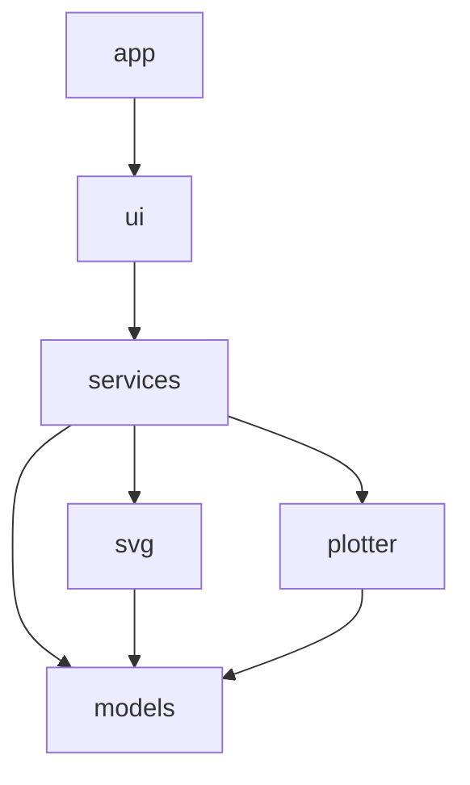

# PlotPilot architecture (initial)

High-level layout for the first milestones. This is intentionally small; details
emerge in SpecKit slices rather than upfront design documents.

## Goals

- macOS desktop app for pen plotters (AxiDraw first)
- Open SVG, inspect layers, preview one layer, plot one layer at a time
- Change pen between layers; basic motion and pen settings
- Test core logic without hardware

## Module map

```
src/plotpilot/
  app/       Application entry, Qt app lifecycle
  ui/        Windows, widgets, user actions (no serial/USB/plotter calls)
  svg/       Parse SVG, list layers, paths for preview/plot prep
  plotter/   Plotter interface + AxiDraw (and future devices)
  services/  Use-cases: open file, select layer, build job, send to plotter
  models/    Layer, document, plot settings, job state
```

## Dependency direction



- **ui** calls **services** only (not `plotter` or low-level SVG parsers directly).
- **services** coordinates **models**, **svg**, and **plotter**.
- **plotter** exposes a narrow interface (connect, pen up/down, plot paths, settings).
- **svg** has no Qt imports.

## SpecKit alignment

Each user-facing capability is a slice under `specs/NNN-slug/` with its own
`spec.md`, plan, and tasks. The next planned slice after **002-svg-layers** is **003-layer-preview**.

## Out of scope for foundation

SVG parsing, preview rendering, AxiDraw communication, PyInstaller bundling, and
CI release pipelines are separate slices.
