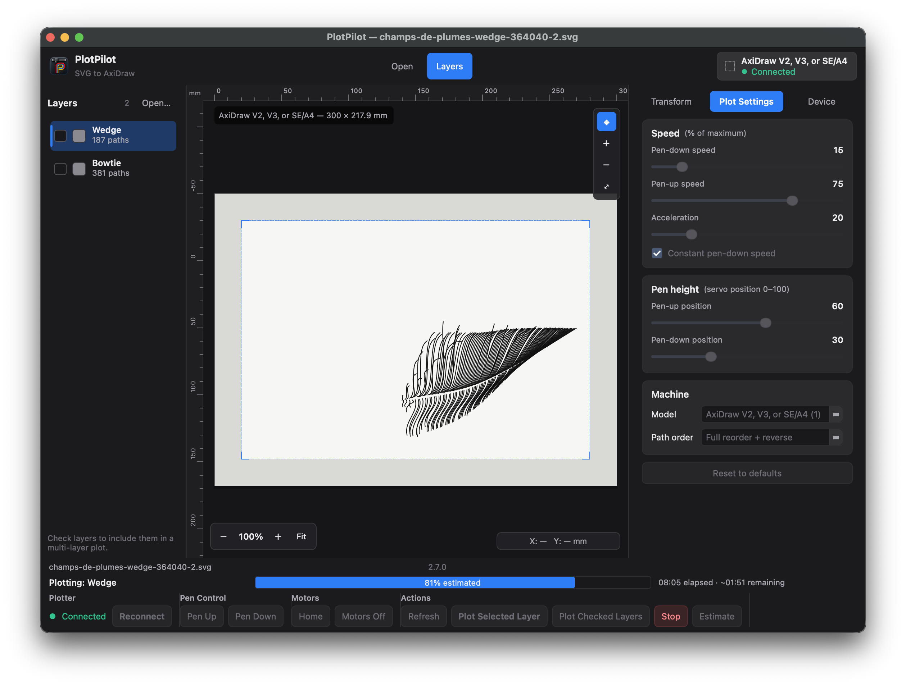

# PlotPilot user guide

PlotPilot is a macOS app for sending SVG drawings to an [AxiDraw](https://axidraw.com/) pen plotter. This guide covers the window, a normal plotting session, and the controls you will use most.

  

The window has four regions:

| Region | What it is for |
|---|---|
| **Top bar** | Open a file, jump to Preview, Layers, or Plot, and see whether the plotter is connected |
| **Layers** | Choose the layer on screen and check the layers that belong in a job |
| **Preview** | The page, in millimetres, with rulers and the drawing as it will be plotted |
| **Properties** | **Transform**, **Plot Settings**, and **Device** |
| **Bottom bar** | Connection, pen, motors, plot, estimate, progress, and pen-change pauses |

The three columns can be resized. **View → Layers Sidebar** (**⌘⇧L**) hides the layer list when you want a wider page.

## Before you plot

1. Connect the AxiDraw by USB.
2. Launch PlotPilot. A disk image from `./publish.sh` already contains `axicli`: open it, drag PlotPilot to Applications, then open the app. From a source checkout, `./open.sh` still needs [AxiDraw software](https://axidraw.com/doc/) so `axicli` is on your `PATH` (see the [README](../README.md)).

The device chip in the top bar turns green and reads **Connected** when the plotter answers. **Reconnect** and **Refresh** ask again. While the app is idle it also checks for the plotter on its own.

You can open files, place artwork, and change settings with no machine attached. Plot, estimate, pen, and motor commands need a connection.

## Open a drawing

**File → Open SVG…** (**⌘O**), the **Open** button in the top bar, or **Open SVG…** on the empty preview.

PlotPilot reads a valid SVG and reports a clear error for a missing file, a non-SVG file, or a file it cannot parse.

Layers come from Inkscape layer markup. If the file has none, top-level groups become layers. Each row shows:

- a checkbox, for multi-layer jobs
- the layer colour
- the layer name
- how many paths it contains

Hidden layers stay in the list and are marked. Select a row to preview that layer. The header badge is the layer count.

If the SVG has no page size, set a fallback **work area** and orientation on the Transform tab. Otherwise the page size comes from the file, and the selected AxiDraw model supplies the physical travel limits.

## Preview

The centre of the window is the machine page:

- rulers in millimetres
- the physical work area
- a margin band and a dashed **printable** rectangle
- the prepared strokes for the selected layer
- a faint copy of the source drawing, clipped to the work area, so you can see what was cut off

**Fit** (bottom of the preview, or **⌘0**) frames the page. **+** / **−** (**⌘+** / **⌘−**) zoom. Scroll to pan once you are zoomed in; the middle mouse button pans as well. The readout under the page shows the cursor in millimetres. Fit also clears pan.

The **move** tool (✥, on by default) drags the drawing inside the printable area. That drag edits the same X and Y as the Transform sliders. Panning the view does not move the drawing. The move tool is inactive while a plot is running.

## Place the drawing

Open the **Transform** tab (**⌘1**).

| Control | Effect |
|---|---|
| **Position** X / Y | Move the drawing in millimetres. Double-click a slider, or use **Reset X** / **Reset Y**, to clear one axis |
| **Scale** | Resize about the placement. Presets are 50%, 100%, 150%, and 200%. The percent box accepts other values |
| **Margins** | Horizontal and vertical safe margins, in 0.1 mm steps. The default is 10 mm on each axis. Link the two values if you want them to stay equal |
| **Orientation** | How the page is turned before clipping |
| **Reset All** | Clears position, scale, and orientation. Margins and plot settings stay as they are |

**Printable** is the work area after margins. Anything outside that rectangle is clipped and is not sent to the plotter. The faint source drawing may still extend into the margin so you can see the cutoff. PlotPilot does not auto-centre or auto-fit when you scale or drag past the edge.

Orientation choices:

- **Preserved** — keep the page as drawn in the SVG
- **Auto-rotate to fit** — turn 90° counter-clockwise when the page and the printable area disagree on portrait versus landscape
- **Rotate 90° CCW** / **Rotate 90° CW** — always turn the page that way

Rotation happens in PlotPilot, before clipping, so the preview and the plot stay the same. The AxiDraw driver is told not to rotate the file again.

The model’s travel limits are the outer page. A drawing that cannot fit is reported on the Transform tab; clipping still keeps the pen inside the printable rectangle.

## Plot settings

Open **Plot Settings** from the top bar, or press **⌘2**.

Speeds and acceleration are a percent of the machine maximum (1–100). Pen up and pen down positions are servo values from 0 to 100. **Constant pen-down speed** asks the driver to hold pen-down speed steadier on curves.

**Model** selects the AxiDraw travel area:

| Model |
|---|
| AxiDraw V2, V3, or SE/A4 |
| AxiDraw V3/A3 or SE/A3 |
| AxiDraw V3 XLX |
| AxiDraw MiniKit |
| AxiDraw SE/A1 |
| AxiDraw SE/A2 |
| AxiDraw V3/B6 |

**Default (CLI)** leaves the model to the driver’s own configuration file.

**Path order** controls how `axicli` reorders strokes:

| Option | Meaning |
|---|---|
| Driver default | Let `axidraw_conf.py` decide |
| None / strict file order | Draw paths in file order |
| Basic reorder | A lighter reorder |
| Full reorder + reverse | Reorder and reverse paths to shorten pen-up travel |

**Reset to defaults** restores this panel. Plot settings are saved on this Mac and come back the next time you launch PlotPilot. They are also stored inside a project file, which does not overwrite those saved defaults when you reopen the project.

These controls, and the Transform controls, are locked while a plot is running.

## Plot

The action bar along the bottom is the machine console.

| Button | Action |
|---|---|
| **Pen Up** / **Pen Down** | Raise or lower the pen |
| **Home** | Walk the carriage home |
| **Motors Off** | Disable the XY motors so you can move the carriage by hand |
| **Estimate** | Ask the driver how long the job would take. Checked layers are timed when any are checked; otherwise the selected layer is timed. Placement, margins, and speeds are included |
| **Plot Selected Layer** | Plot the layer highlighted in the list |
| **Plot Checked Layers** | Plot every checked layer, in list order |
| **Stop** | Cancel the plot and run the safe stop |

During a plot the bar shows the layer name, a percent complete, time elapsed, and an estimate of time remaining.

**Stop** raises the pen, walks home, and disables the XY motors. Use it whenever you need the pen off the page and the carriage out of the way.

### Several pens

Check every layer that should be part of the job, then **Plot Checked Layers**. After a layer finishes, PlotPilot pauses with a pen-change prompt. Change the pen (or the paper, if that is the point of the pause) and press **Continue**. **Stop** ends the whole job.

### Estimate first

**Estimate** runs the same prepared geometry the plot would use, including clipping to the printable area, and prints a duration on the status line. Checked layers are included when any box is checked; otherwise the selected layer is measured. The command is an offline preview (`axicli` with `-v -T`) and does not move the plotter. Change margins, scale, or speed and estimate again; the number follows the current setup.

## Projects

A project remembers one drawing’s setup:

- path to the SVG
- which layers are checked
- position, scale, and orientation
- print margins
- plot settings
- fallback work area, when the SVG has no page size

**File → Save Project** (**⌘S**) writes a `.plotpilot` file. **Save Project As…** is **⌘⇧S**. **Open Project…** is **⌘⇧O**. The window title shows the SVG or project name.

The project stores the path to the SVG, so keep the drawing where the project expects it. Reopening a project restores that job’s margins and settings and leaves your global defaults alone.

## Keyboard shortcuts

On a Mac, these use the Command key.

| Shortcut | Action |
|---|---|
| **⌘O** | Open SVG |
| **⌘⇧O** | Open project |
| **⌘S** | Save project |
| **⌘⇧S** | Save project as |
| **⌘⇧L** | Show or hide the layers sidebar |
| **⌘0** | Fit the preview |
| **⌘+** / **⌘−** | Zoom in / zoom out |
| **⌘1** | Transform tab |
| **⌘2** | Plot settings tab |
| **⌘3** | Device tab |

## Device tab

**⌘3**, or click the device chip, opens connection details: model, firmware line when the driver reports one, and the latest plotter message. Pen, home, motors off, and refresh are repeated here so you can run the machine without the bottom bar in view.

## Good habits

- Fit the preview and read the printable size before the first plot of a new file.
- Leave a margin (the default is 10 mm) so the pen stays off the mechanical edge.
- Run **Estimate** after a large scale or margin change.
- Plot one simple layer before a long checked-layer job.
- Save a project once placement and speeds are right.
- **Stop** if anything looks wrong. The pen comes up and the carriage goes home.

## What this version does not include

PlotPilot drives an AxiDraw through `axicli`. Other plotter backends are not shipped. `./publish.sh` builds a notarized disk image and attaches it to a GitHub Release. That image includes `axicli`.
